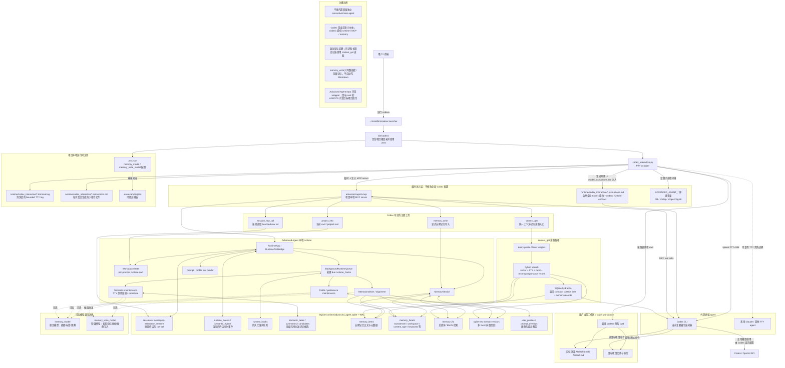

# Advanced Agent / codexx

面向 Codex（以及未来 Claude 等外部 agent）的本地 runtime / memory wrapper。

项目当前定位不是独立聊天 agent，而是给外部模型客户端提供：

- 项目级 MCP 工具；
- SQLite-backed durable memory；
- bounded raw tail / session context；
- profile hints 和后台维护；
- Codex PTY wrapper 与日志/退出维护。


## Agent-readable docs graph

This repo uses a local Markdown docs graph for concise, path-addressable project context:

```text
docs_graph/docs_graph.md
```

Start there for current architecture, runtime, memory, Codex wrapper, plugin, testing, and operations boundaries. The existing `docs/` directory remains the detailed background archive.

## 推荐入口

直接启动增强交互式 Codex：

```bash
codexx
```

`codexx` 会自动使用本项目的 `.venv`，不需要手动激活虚拟环境。

## 安装与系统要求

推荐在 Linux 上使用：

- Linux shell 环境；
- Codex CLI 已安装，并且 `codex` 在 `PATH` 中；
- Python `>= 3.11`，且可创建 venv；
- pip 可安装依赖。

本项目的 Python 依赖安装在项目内 `.venv/`，不会安装到系统 Python。
当前依赖见 `pyproject.toml`：

- `httpx>=0.27`
- `mcp>=1.27`
- `sqlite-vec>=0.1.9`

首次安装：

```bash
cp .env.example.json .env.json
bash scripts/install.sh
```

安装脚本会：

1. 创建或复用项目内 `.venv`；
2. 把本项目以 editable 方式安装到 `.venv`；
3. 在项目目录外只创建一个用户级入口：

```text
~/.local/bin/codexx
```

如果 shell 找不到 `codexx`，把用户本地 bin 加入 `PATH`：

```bash
export PATH="$HOME/.local/bin:$PATH"
```

可以把上面一行放进 `~/.bashrc` / `~/.zshrc`。除此之外，默认安装不修改
shell rc、`~/.codex/config.toml`、`/usr/bin` 或其他系统目录。

查看并手动卸载用户级入口：

```bash
bash scripts/remove_guidance.sh
```

该脚本只校验 `~/.local/bin/codexx` 是否是本项目生成的 launcher，并打印
`rm -i` 命令；不会自动删除用户文件。

## 运行时环境边界

`codexx` 使用一个默认配置文件 `.env.json`，并自动设置项目内运行时环境变量：

- `ADVANCED_AGENT_DB=runtime/advanced_agent.sqlite`
- `ADVANCED_AGENT_CONFIG=.env.json`
- `ADVANCED_AGENT_SCOPE=project:advanced_agent`
- `ADVANCED_AGENT_MEMORY_TRUST=high`

这些环境变量只在 `codexx` 启动的子进程内临时设置；普通 shell 不需要全局
export `ADVANCED_AGENT_*`。

它会启动 Codex，并自动注入项目级 MCP server，让 Codex 能调用
`context_get`、`memory_write`、`session_raw_tail`、`project_info` 等记忆/上下文工具。


## 当前版本整体架构图

这张图是面向用户的当前版本总览：`codexx` 不是旧设计里的独立 interactive/main agent 系统，
而是包在 Codex/未来其他终端 agent 外面的本地 runtime、MCP 工具和长期记忆层。



## 核心思想

- **外部 agent 为语义主体**：Codex/Claude 自己调用模型、决定何时用工具；本项目不再内置 interactive/main 聊天 agent。
- **上下文按需读取**：外部 agent 通过 `context_get` 拉取项目状态、历史、记忆和画像提示，避免启动时固定塞大量上下文。
- **记忆不是聊天记录堆积**：长期信息通过 `memory_write` 和后台维护写入向量库/结构化索引；raw tail 只做短期溢出查看。
- **本地 runtime 边界清晰**：SQLite、MCP、hook queue、Codex wrapper、future Claude wrapper 都保持 provider-neutral。

## 当前目录重点

```text
codexx/
├── README.md                         # 用户入口与当前总架构图
├── AGENTS.md                         # 当前项目级 Codex/codexx 工作说明
├── docs/
│   ├── codexx_runtime_architecture.md # codexx wrapper/runtime 细节
│   ├── codexx_entrypoint.md           # launcher、MCP 注入、启动行为
│   ├── codexx_runtime_instructions.md # 注入给 Codex 的 runtime contract
│   └── memory_design.md               # 记忆和向量库设计
├── bin/
│   └── codexx                         # 项目内 launcher
├── scripts/
│   └── install.sh                     # 安装用户级 ~/.local/bin/codexx
├── src/advanced_agent/
│   ├── codex_interactive.py           # PTY wrapper / log / maintenance hooks
│   ├── mcp_server.py                  # project-local MCP server
│   ├── runtime_tools.py               # MCP/runtime tool bridge
│   ├── memory_service.py              # durable memory service
│   ├── memory_indexer.py              # memory candidate/indexing path
│   └── stores/                        # SQLite-backed data access interfaces
└── tests/                             # core / integration tests
```

## 真实模型配置

本项目使用 JSON 格式本地配置，默认读取 `.env.json`。该文件已被 `.gitignore` 忽略，不要提交 API key。可从模板复制：

```bash
cp .env.example.json .env.json
```

格式核心是：

```json
{
  "roles": {
    "memory_model": "memory-cheap",
    "memory_write_model": "memory-strong"
  },
  "models": {
    "memory-strong": {
      "provider": "openai_compatible",
      "model": "MODEL_NAME",
      "base_url": "https://api.example.com/v1",
      "api_key_env": "MEMORY_WRITE_MODEL_API_KEY"
    }
  }
}
```

`memory_model` 用于可选的记忆标签/画像候选；`memory_write_model` 用于可选的画像写入批准。Codex 自身模型配置仍由 Codex CLI 管理。
