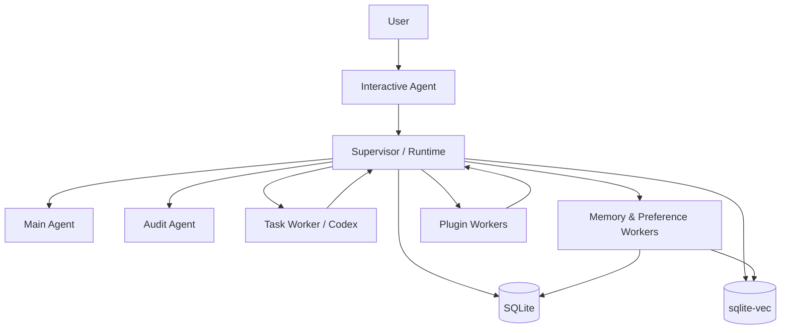
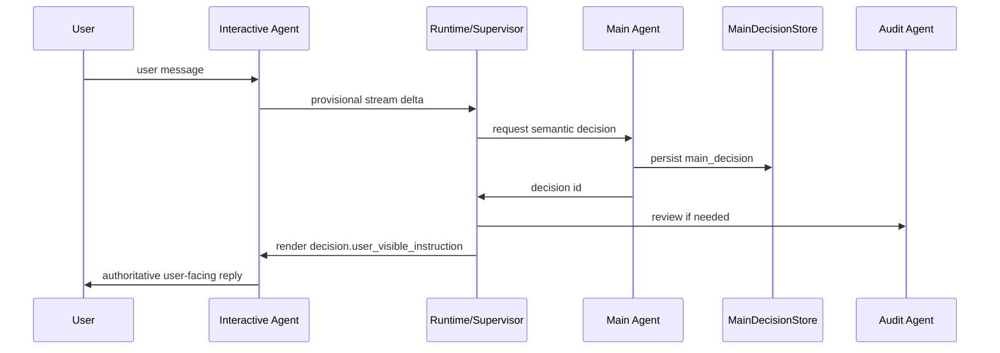
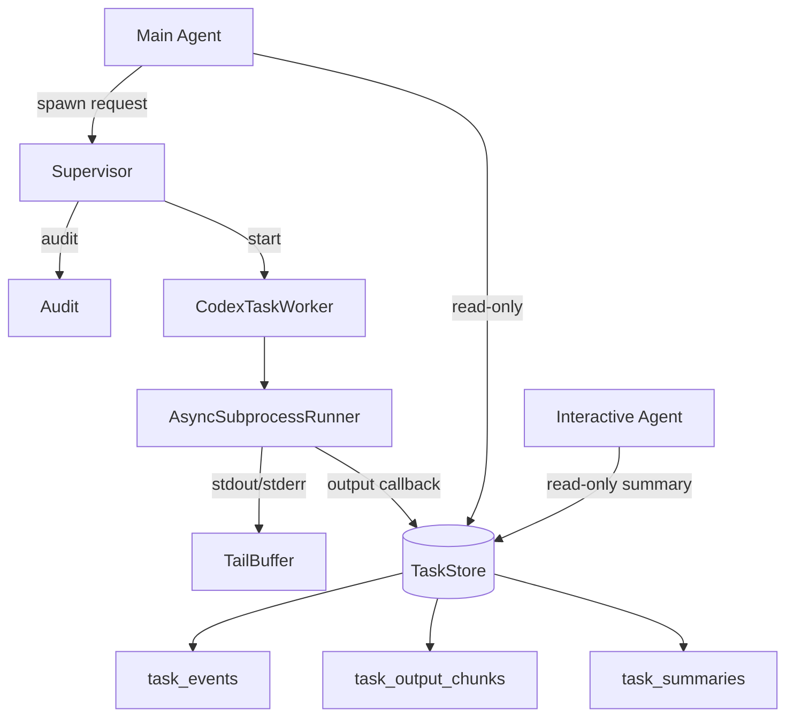
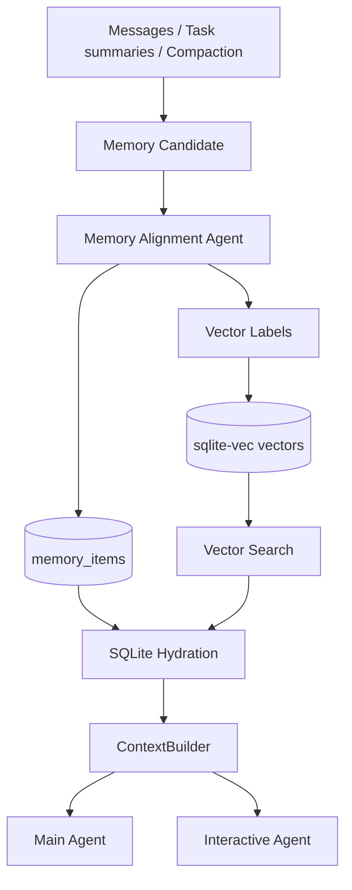
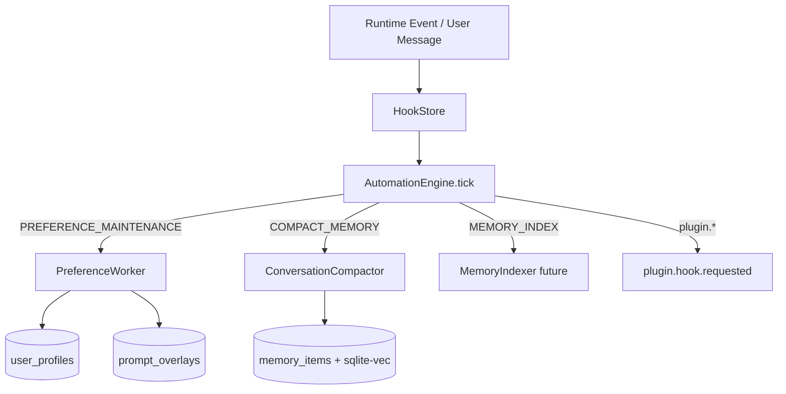
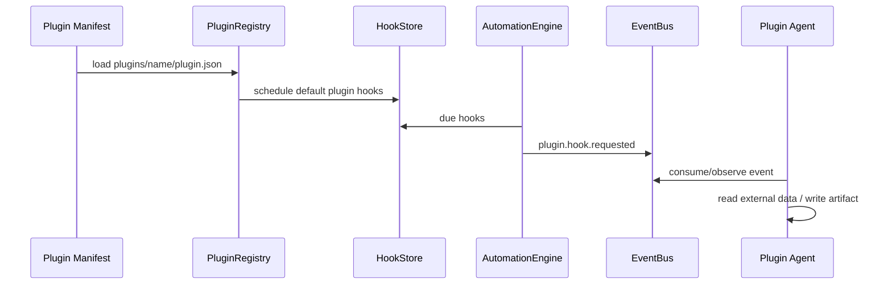

# Architecture Diagrams

These diagrams are normative. New implementation should follow these flows instead of relying on implicit cross-calls.

## 1. Process / role topology

## 2. User request flow

## 3. Task / Codex progress inspection

## 4. Memory indexing and retrieval

## 5. Hook automation

## 6. Plugin hook flow

