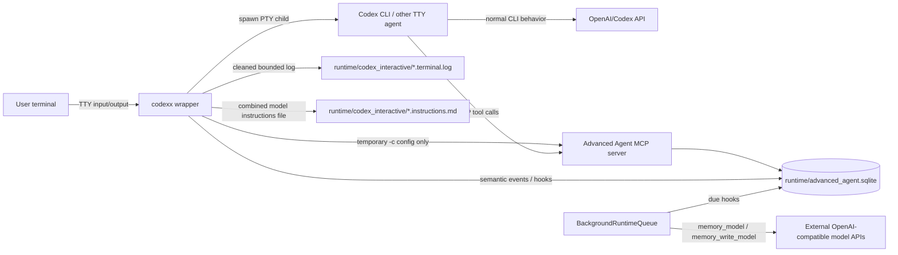
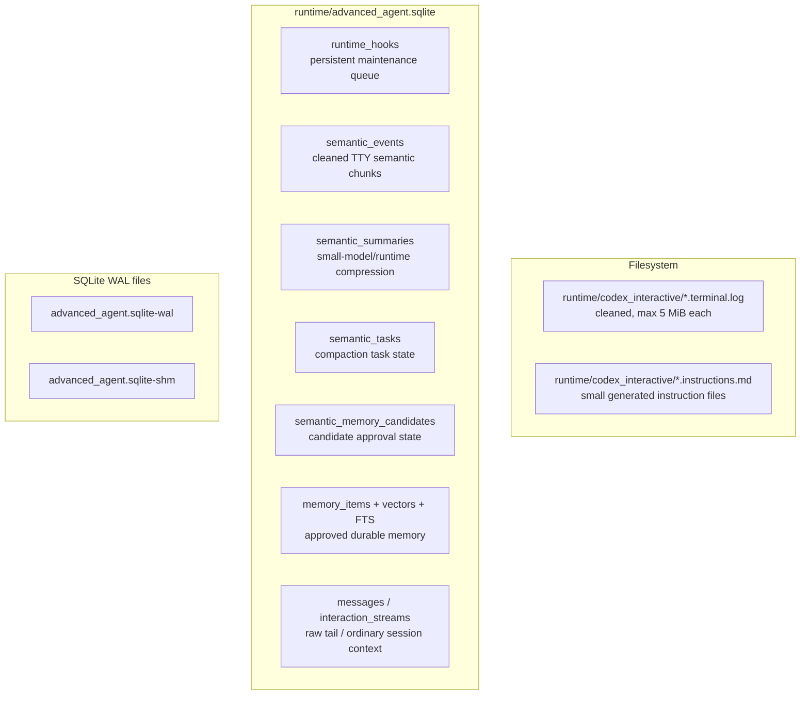
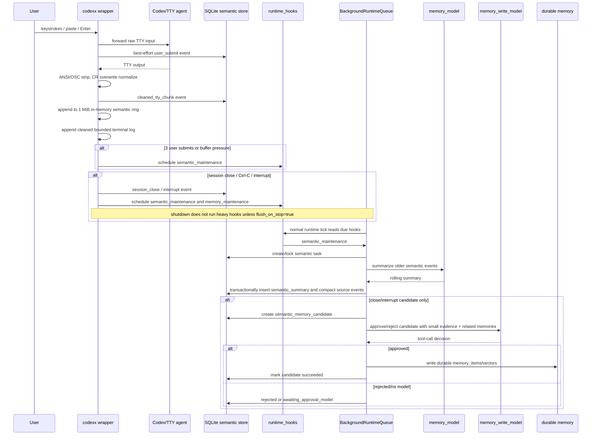
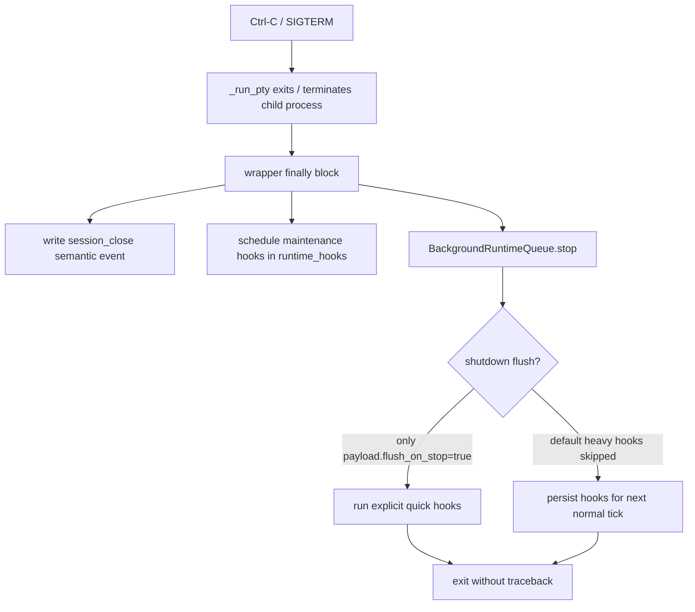
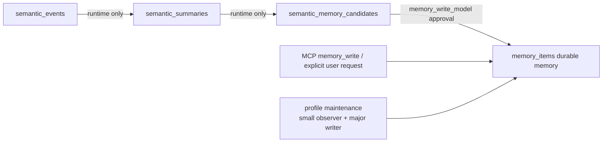
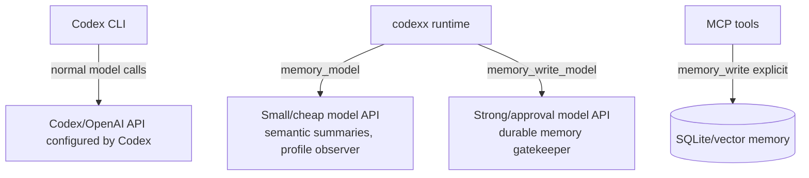

# codexx runtime architecture

这份图用于说明 `codexx` 对 Codex/终端 agent 的侵入边界、外部资源使用、
任务队列、SQLite 数据库、日志文件、模型 API 调用，以及内部处理流程。

## 1. 外部接入与侵入边界

侵入方式：

- 不修改 Codex 全局配置。
- 启动时通过临时 `-c` 注入：
  - project-local MCP server
  - temporary `model_instructions_file`
- Codex 仍然使用自己的模型/API；`codexx` 只包一层 PTY、MCP 和 runtime。
- 对 Claude 或其他 TTY agent，主路径仍然是通用 TTY 清洗，不依赖 Codex 专有 transcript。

## 2. 磁盘资源分类

当前限制/策略：

- `runtime/codex_interactive` 只保留最近 32 个 Codex session。
- 每个 `.terminal.log` 是清洗后的 TTY 内容，最大 5 MiB。
- `semantic_events/summaries/tasks/candidates` 是 runtime 状态，不是长期记忆。
- 只有 `memory_items` 是 durable long-term memory。
- SQLite WAL 可能临时变大，属于正常 WAL 行为，可通过 checkpoint 收缩。

## 3. 数据处理主流程

## 4. Shutdown / Ctrl-C 行为

Important points:

- Ctrl-C should prioritize quick exit.
- Model-heavy summary/profile/memory approval hooks are not run during shutdown flush by default.
- The hook remains in SQLite and is picked up on the next normal runtime tick.
- `kill -9` cannot run exit handlers, but already committed semantic events/tasks remain recoverable.

## 5. Long-term memory boundary

What does **not** directly become long-term memory:

- cleaned terminal logs
- semantic events
- semantic summaries
- raw codex_tail
- routine three-user-turn compactions

What may become long-term memory:

- explicit `memory_write`
- profile/behavior records approved by the major writer
- close/interrupt semantic candidates approved by the major writer

This keeps the semantic layer as a small context/compression window rather than
polluting durable memory with noisy terminal history.

## 6. API/model call locations

Cost control:

- Routine semantic compaction calls only the small model.
- Long-term memory approval is limited to close/interrupt candidates.
- Shutdown does not run heavy model hooks by default.
- Direct explicit memory writes bypass model approval because the user/tool call
  is already an explicit durable-memory action.
